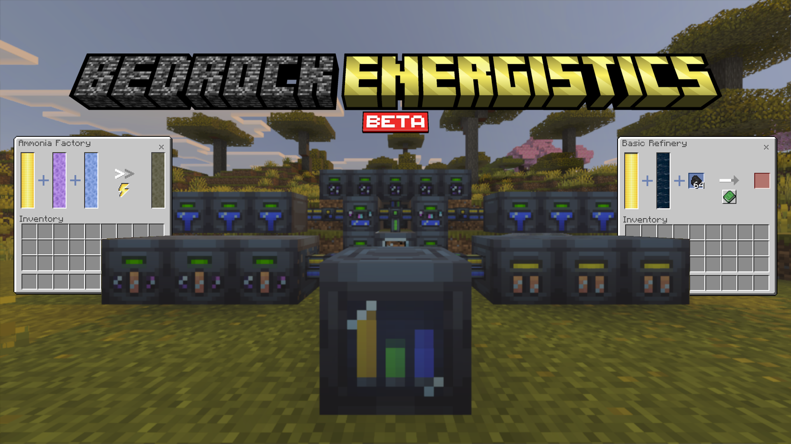

Expands Bedrock with energistics! Adds many machines to Minecraft, with custom UI. Powered by [Bedrock Energistics Core](https://github.com/Fluffyalien1422/bedrock-energistics-core).

> [!IMPORTANT]
> This add-on is in beta and should not be considered stable.

## Configuration

Configure the add-on by editing `scripts/__config.js` in the behavior pack with any text editor.

Every option is optional and is documented with a comment in the file. Remove an option to use its default. If an option is missing or set to the wrong type, its default is used and a warning is logged to the content log.

## Contributing

**This repository does not accept third-party pull requests.** [Issues](https://github.com/Fluffyalien1422/bedrock-energistics/issues) are welcome for bug reports, feature requests, and other feedback. Thanks for your understanding.

## License

This project is licensed under the [ISC License](LICENSE).
